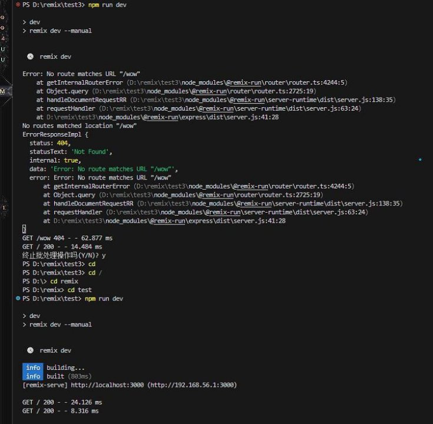

REMIX ![ref1]![ref2]

I n t e r n e t  T e c h n o l o g i e s 

REPORTER : Zili LU TIME: 17/10/2023                    Ziyang CHEN 

`                   `Jiawei XU 

`                   `Wenqi YIN 

**SceAnario **

**My APP Pros &** 

**cons**

**Introduction  Contribution**

3

2 4

C o n t e n t s

1 5

01 **Introduction![ref3]![ref4]**

**01  Introduction ![ref5]**

![ref6]

01

![ref7]

**History**

02

![ref7]

**Key Features**

03

![ref7]

**Web Development with Remix**

04

![ref7]

**Ecosystem**

05

![ref7]

**Community &** 

**Resources**

![ref6]

- Simplicity
- Efficiency
- Adaptability
- Strong Typing
- Building interactive web applications.
- Creating single-page applications (SPAs).
- Developing server-rendered web pages.
- Integrating with various databases and APIs.
- Remix Router 
- Remix Server 
- Remix Data 
- Remix Session 

![ref6]

**02 My APP![ref8]![ref4]**

![ref6]

**A scenario where the ![ref8]![ref4]**

3  **technology be used**

![ref6]
![ref5] **03 Build a feature-rich e-commerce website**

Efficient Client Routing Integration with other tools and libraries

 **1 2 3 4**

Server-side rendering    Built-in caching and optimisation capabilities

1\.**The server-side rendering capabilities of the remix framework are utilised to generate dynamic web pages on the server and deliver them to the client.** This allows websites to load and deliver content to users quickly, without having to wait for additional client-side rendering.

2\.**The remix framework provides built-in caching and optimisation features.** This means that static resources, such as images or CSS files, can be cached and served efficiently, further enhancing the speed and performance of your website.

3\.**The remix framework can be easily integrated with other tools and libraries such as state management systems or API integrations.** This flexibility enables development teams to build a robust and scalable e- commerce application capable of handling high traffic and complex business logic.

![ref6]

4  **Pros & Cons![ref3]![ref4]**

![ref6]
**04 Pros and Cons ![ref5]**

**Server-side rendering(SSR):** in remix excels, delivering content quickly 

1  and enhancing search engine indexing for a better user experience.

   2  **Performance:** Remix is optimized for fast client-side navigation, 

**Pros of**  data preloading, and ensuring a speedy critical rendering path. **using** 3 **Developer Experience:** Remix provides a developer-friendly 

environment with structured project layout, built-in routing, 

data loading, and promotes best practices to reduce boilerplate code.

4  **TypeScript Support:** Remix, being built with TypeScript, is ideal for projects that benefit from static type checking for better code quality and maintainability.
5  **Code Splitting:** Remix enables automatic code splitting, loading only necessary code for each route, enhancing load times and minimizing initial bundle sizes.

**Pros of** 

**Client-Side Navigation:** Remix offers seamless client-side navigation for **using** 6 creating single-page applications (SPAs) with server-rendered content.

7 **Built-in Data Loading:** Remix simplifies data loading on both the server and client, streamlining data management and rendering.

![ref6]

**04 Pros and Cons ![ref5]**

![ref6]

**Learning Curve **

Time-consuming, it introduces   **01 02** an unique approach to web     

development

**Compatibility  Cons of**     Remix's unique server- side  **06 using 03**

rendering approach may not be 

suitable for all types of projects.

**Tooling 05 04** May not be as mature or feature-

rich, This could impact developer 

productivity and the availability of 

certain features.

**Limited Ecosystem**

There may be fewer third- party libraries, plugins, and community resources available

**Development Overhead**

Lead to additional development overhead and time spent on structuring your code

**Community Support**

May not have the same level of co m m u n ity su p p o rt a n d resources as larger frameworks

![ref6]

05 **Contribution![ref3]![ref4]**

**0 5  C o n t r i b u t i o n![ref5]**

![ref6]

**Zili LU **

- Search the introduction and       

overview part

- Complete ppt

**Ziyang CHEN **

- Framework construction and  

practical operation 

- Complete ppt 

**Jiawei XU**

- Complete the scenario where the  

technology used

- Complete ppt

**Wenqi YIN**

- Search the pros and cons part
- Complete ppt

![ref6]

T h a n k  y o u  f o r y![ref1]![ref2] o u r  lis t e n in g

[ref1]: Aspose.Words.ea3bc00f-38ce-40da-b278-fb249e4fd5a9.001.png
[ref2]: Aspose.Words.ea3bc00f-38ce-40da-b278-fb249e4fd5a9.002.png
[ref3]: Aspose.Words.ea3bc00f-38ce-40da-b278-fb249e4fd5a9.006.png
[ref4]: Aspose.Words.ea3bc00f-38ce-40da-b278-fb249e4fd5a9.007.png
[ref5]: Aspose.Words.ea3bc00f-38ce-40da-b278-fb249e4fd5a9.008.png
[ref6]: Aspose.Words.ea3bc00f-38ce-40da-b278-fb249e4fd5a9.009.png
[ref7]: Aspose.Words.ea3bc00f-38ce-40da-b278-fb249e4fd5a9.012.png
[ref8]: Aspose.Words.ea3bc00f-38ce-40da-b278-fb249e4fd5a9.024.png
